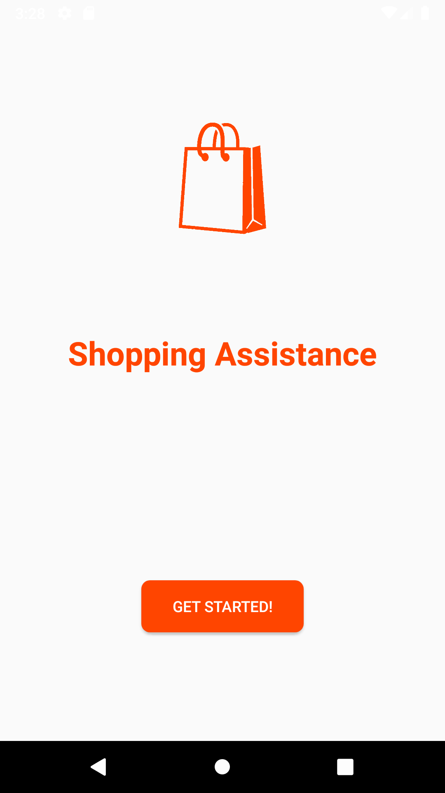
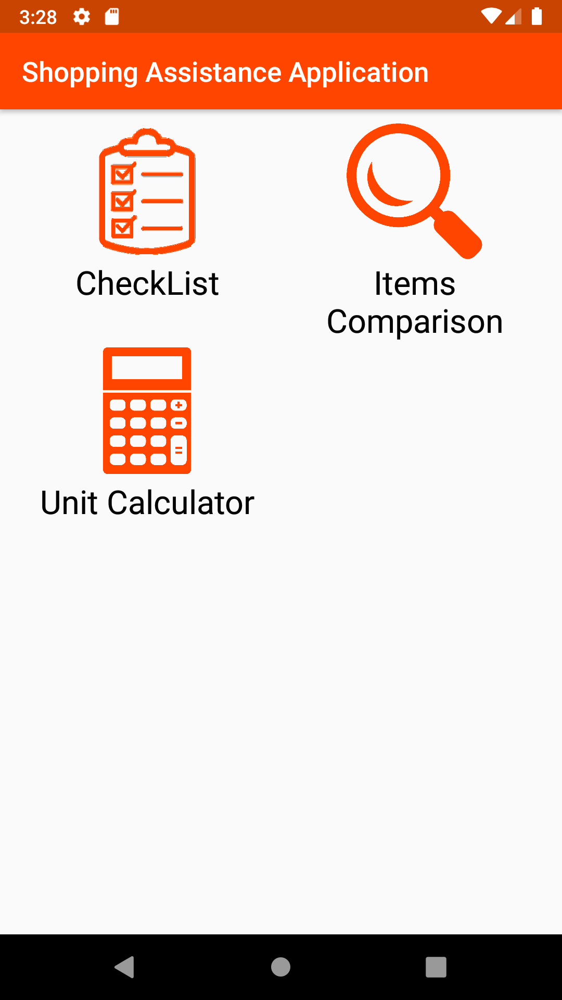
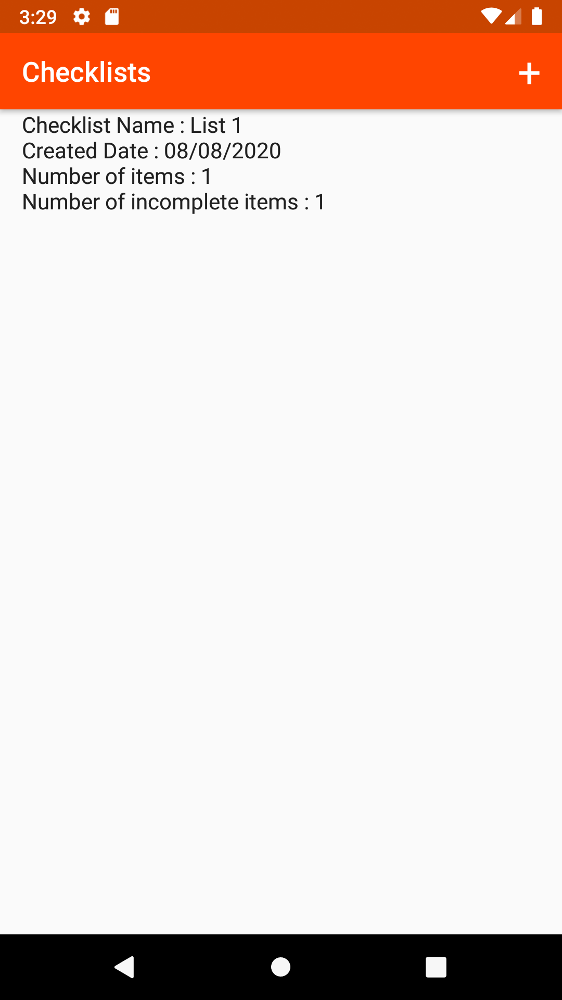
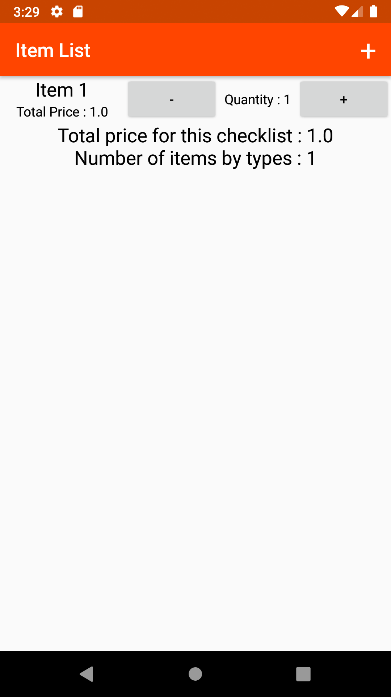
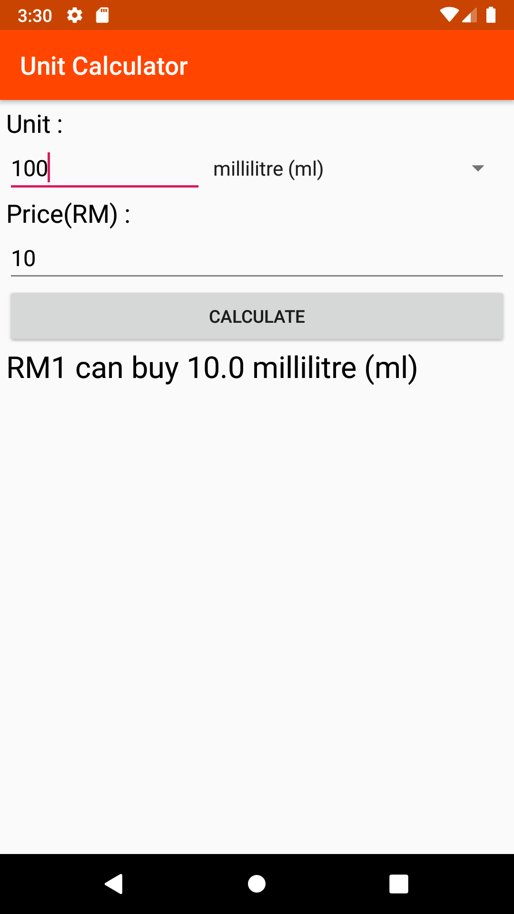
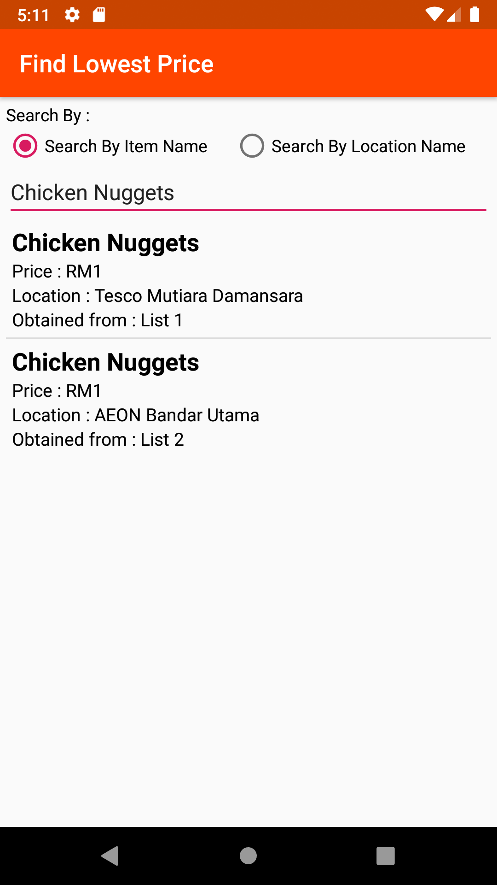

# Shopping Assistance Mobile App
Shopping is a common activity done by everyone in order to get or replenish stuffs that are needed, thus most of the time the variety of the things can be a lot until it becomes very difficult to remember all of them. Shopping Assistance Application is an application that can remind users the list of items they want to buy with checklist and track the history of the previous purchases to allow comparisons, so the users can adjust the quantities of certain items to be purchased according to the needs at that particular time.

## Screenshots

